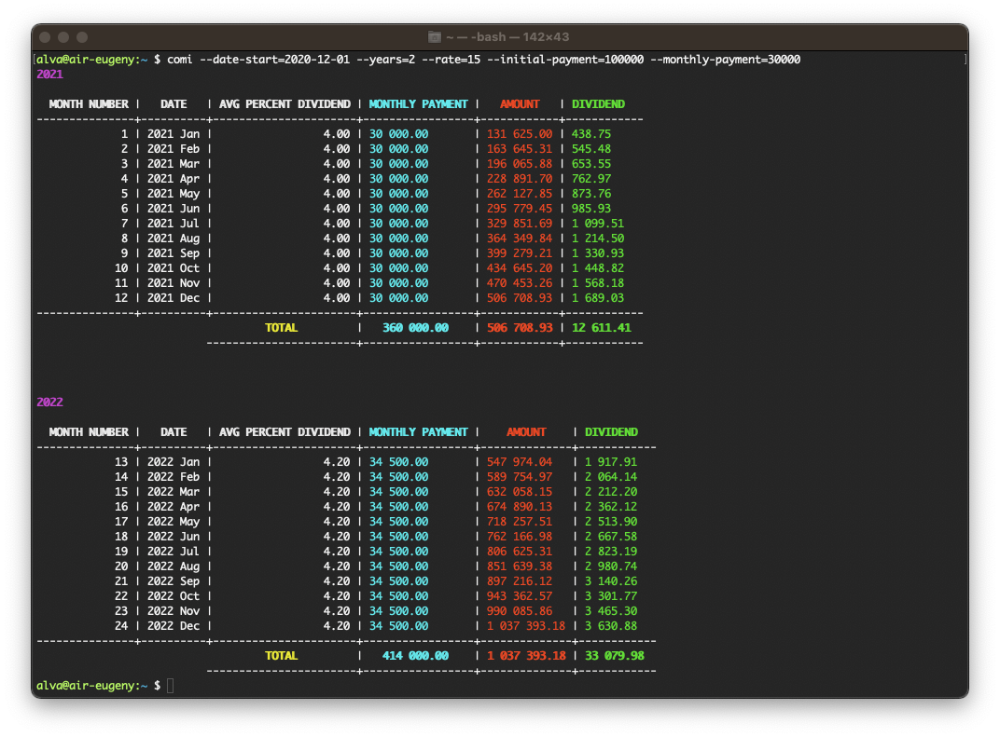

## Calculate compound interest 

### [Install](./docs/INSTALL.md)

### Options
* ```--monthly-payment=30000``` - monthly payment
* ```--date-start=2020-12-01``` - start date of investment (default: now date)
* ```--years=10``` - investment term in years (default: "1")
* ```--rate=15``` - percent rate (default: "10")
* ```--initial-payment=100000``` - initial payment (default: "0")
* ```--percent-increase-monthly-payment=15``` - annual percentage increase in monthly payment (default: "15")
* ```--avg-percent-dividend=4``` - avg percent dividend (default: "4")
* ```--percent-increase-dividend=5``` - annual percentage increase dividend (default: "5")

### Run
```shell
comi --date-start=2020-12-01 --years=2 --rate=15 --initial-payment=100000 --monthly-payment=30000
```


